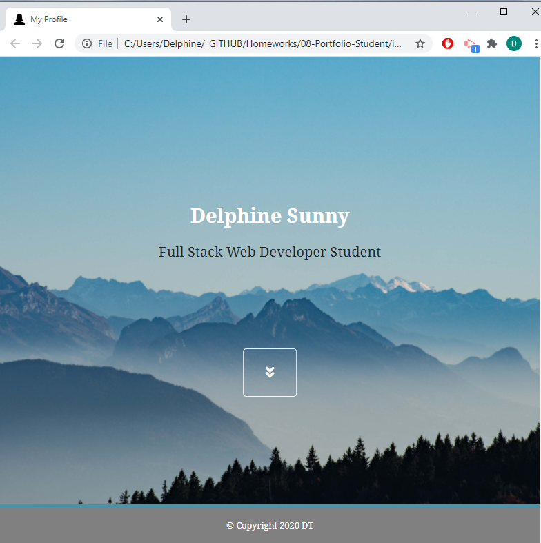

# 08-Portfolio-Student
   

---

 
   
 
   

---

## Table of Contents  
* [Description](#Description)  
* [Installation and Usage](#Installation-and-Usage)  
* [Images of the Page](#Images-of-the-Page)  
* [Credit](#Credit)  
* [License](#License)  
* [Contact](#Contact)  

## Description 

The Bootstrap portfolio has the following criteria:  

   * Do not look like a standard Bootstrap basic project  

   * Contain three sections: `about`, `portfolio` and `contact`  

   * List all the past projects completed for the year 2020  

   * Have a responsive layout  

   * Have a sticky footer  

## Installation and Usage  

Click on this [link] or download the entire repository, unzip the files and double-click on `index.html` to see the page in an internet browser.  
Scroll to the list of projects and click on the image to access to the deployed page or click on the `Github repo` button to access the source code.  
**Note:** Preserve the folder structure if you download it.  

## Images of the Page  

  

## Credits

Icon made by Pixel perfect from https://www.flaticon.com/  
Background images from https://www.Unsplash.com  

## License

Copyright (c) 2020 DT. This project is [MIT](https://choosealicense.com/licenses/mit) licensed.  

## Contact  

:octocat:  GitHub: [Delphine](https://github.com/Delph-Sunny)  

---
[link]: https://delph-sunny.github.io/02-CSS-Bootstrap/
